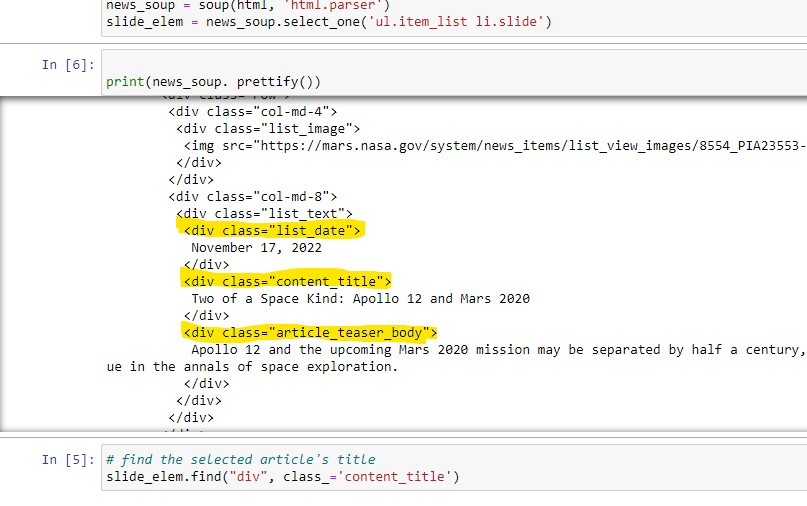
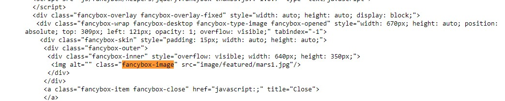
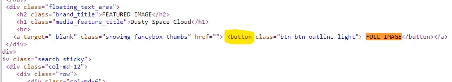
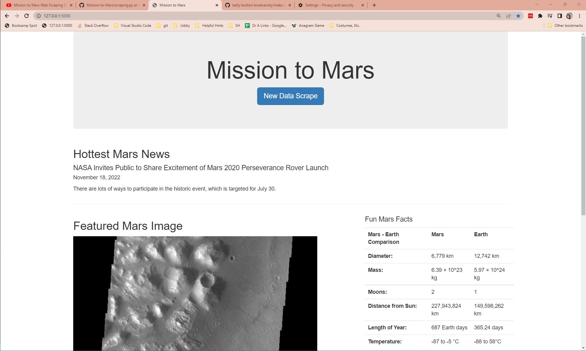
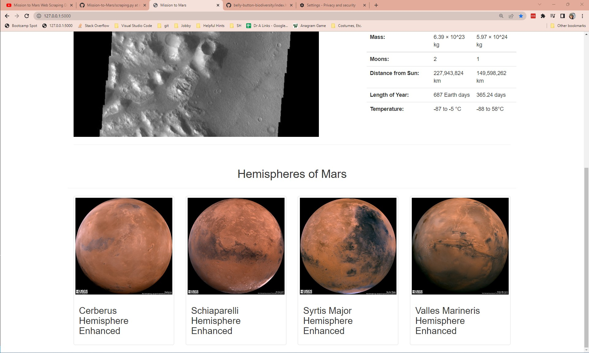

# Mission To Mars
For Module 12 : web-scraping-challenge 

### Instructions
In this assignment, you will build a web application that scrapes various websites for data related to the Mission to Mars and displays the information in a single HTML page. The following information outlines what you need to do.

The instructions for this assignment are divided into three parts: 

1. Scraping 

2. MongoDB and Flask Application

3. Submission 

### Code Theory
The work was done on these files in the order they're listed.

**For mission_to_mars.ipynb**
1. Set up the repo as described
2. Imported dependencies, including new ones like Splinter and BeautifulSoup.
3. Set the executable path and initialized the Chrome Browser in Splinter
4. For the next sections, we visited the websites and scraped data as required.
5. For the Mars Hemispheres, we had to cycle through each link so we used a for loop and then returned to the previous page.
6. Once all the data was scraped, we quit the browser.

Also noticed that printing out the HTML with .prettify() helped a lot when looking for class names. Below are examples of how I was able to search different tag elements: 
 
 
 

**For scrape_4_mars.py**
1. Set up functions for each object we scraped for. 
    * scrape_all: to gather all information
    * scrape_mars_news: to gather the latest news date, title and article paragraph
    * scrape_imgs: to get the featured image
    * scrape_facts: to gather the table of facts about Mars and Earth.
    * scrape_hemis: to gather images and names of each hemisphere of Mars
2. Copied most of the code from the Jupyter Notebook, mission_to_mars.ipynb to its corresponding function
3. Removed any lines to show the output in Pandas and used the **return** function instead.
4. Made sure that the Flask App code was included at the bottom.

**For app.py**
1. Set up the dependencies, including Flask, render_template, redirect and url_for
2. Set up the Flask to Mongo connection.
3. Set up the @app.routes to declare what happens at the index.html and the **/scrape** page
4. Index.html shows a random fact pulled from the database.
5. The /Scrape route:
    * calls the function to scrape_all
    * gathers the information
    * throws the data into the MongoDB
    * redirects the user back to the index.html
Here's a sample of the MongoDB after the DB has been created: 
 

**For index.html**
1. Set up a Templates folder and created a new file, index.html
2. Copied the header information from the Biodiversity assignment and removed some of the extra code (like our self made css file, etc)
3. Setup divs using bootstrap parameters to create a container with sections of each of our objects to display.
    * jumbotron for the header and scrape new button
    * mars news
    * mars featured image
    * mars facts
    * mars hemispheres

**To run the whole thing, here's the sequence.**
1. Run app.py and wait for the Flask App to begin.
2. Head to http://127.0.0.1:5000
3. This page should give you all the objects we listed above.  You then have a button to scrape new data to which updates the index.html page.  Example images are below.  
 
 

